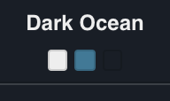

# Dark Ocean Theme

### A dark [Mailspring](https://www.getmailspring.com/) theme inspired by the colours of the deep ocean.

## How to Install

1. Download the code.
2. Open Mailspring and install the theme by going to `Mailspring > Install new theme...` and select the directory.
3. That's it! The theme should change automatically, but if not, just go to `Mailspring > Change Theme...` and choose the theme.

__Enjoy!__